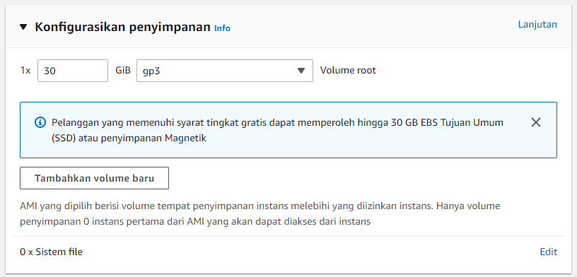

<h1 align="center">Tugas Akhir Arsitektur Jaringan Terkini</h1>
Disini saya akan menjalaskan 4 bagian utama dari tugas akhir matakuliah arsitekur jaringan terkini.

## Bagian 1

### Membuat EC2 Instance di AWS Academy:
- Name and tags: Tugas Akhir

 

- OS Images: Ubuntu Server 22.04 LTS 64 bit

 

- Instance type: t2.medium

 

- Key pair: vockey

 

- Edit Network settings: allow SSH, allow HTTP, allow HTTPS, allow TCP port 8080, allow TCP port 8081

 

- Configure storage: 30 GiB, gp3

 

- Menyiapkan instalasi Mininet+OpenFlow, Ryu dll setelah ec2 telah siap dan telah tersambung dengan ssh.Dengan rujukan yang saya gunakan sebagai berikut [instrutur instalasi](https://awsacademy.instructure.com/courses/15355/discussion_topics/32566)
- Pertama kali kita harus melakukan update dan upgrade dengan perintah `sudo apt -yy update && sudo apt -yy upgrade`
- Lalu saya akan memulai instalasi Mininet + OpenFlow dengan mengunduh repositori Mininet dengan perintah `git clone https://github.com/mininet/mininet`.Dilanjutkan dengan perintah untuk proses instalasinya `mininet/util/install.sh -nfv`
- Berikutnya saya melakukan intalasi Ryu dengan menggunakan perintah 

    `git clone https://github.com/osrg/ryu.git`

    `cd ryu; pip install .`

    `cd`
- Terakhir Instalasi FlowManager dengan perrintah `git clone https://github.com/martimy/flowmanager`
- Jika semua telah berhasil akan menghasilkan direktori pada home sebagai berikut 

 

## Bagian 2 
### Membuat custom Topology Mininet seperti gambar dibawah:

 

- Pertama kita membuat custom topologi mininet bertipe file python disini menggunakan file topo.py
- kemudian kodingan python tersebut kita jalankan menggunakan mininet dengan perintah `sudo mn --controller=none --custom topo.py --topo mytopo --mac --arp`. Jika telah berhasil dijalankan tampilan akan sebagai berikut.

 

- kemudian pada mininet kita melakukan testing apakah switch dan host telah  terhubung dengan baik dengan perintah `links` berikut tampilan jika semuanya telah terhubung.

 

- kali ini kita tidak dapat melakukan ping antar host dikarenakan belum adanya flow. selanjutnya kita akan membuat flow agar host dapat berhubungan satu dengan lainnya dengan perintah pada mininet yanga da di file Perintah_flow.txt. Jika telah berhasil tampilan akan sebagai berikut: 

 

- lalu kita coba test ping semuanya dengan perrintah yang ada dimininet yaitu `pingall`. Jika telah sukses akan terlihat seperti gambar dibawah tidak ada dara yang droped atau semunya telah menerima data.

 

- kemudian kita coba test ping ping dengan manual dengan menentukan jalur yang di inginkan disini saya mencoba mwlakukan testing h1 ke h2 dan h5 ke h6. dan hasilnya seperti gambar di bawah.

 

 

## Bagian 3

### Membuat Aplikasi Ryu Load Balancer 
- Disini saya memodifikasi code program load balancer sesuai yang di minta ditugas memiliki 4 host dan host pertama nantinya dijadikan sebagai client web. Dan diseting dengan algoritma round-robin untuk dapat berganti ganti dengan server web dari h1-h4.
 

- Disini menggunakan mininet untuk mebuat topologi sesuai yang ada di soal topo single dan memiliki 4 host menggunakana kontroler remote switch ovs dengan protocol openflow13. Dan jika berhasil dibuat. Kita membuat h2,h3,h4 untuk dijadikan sebagai web server dengan perintah mininet h(n) python3 -m http.server 80 &.
 

- Kemudian dengan h1 curl 10.0.0.100 host 1 akan menjadi client web
 

- Jika telah berhasil kita jalankan program dengan perintah ryu run llb.py dan h1 sebagai client web akan bergantian mengirimkan paket ke server web seperti gambar dibawah
 

## Bagian 4

### membuat Aplikasi Ryu  Shortest Path Routing

- Pertama kali yang harus kita lakukan adalah clone sdn dari github dengan perintah `git clone https://github.com/abazh/learn_sdn`.
 
- Kedua menunjuk directory learn_sdn/Spf dengan perintah `cd learn_sdn/Spf`
 
- Ketiga menjalankan controller ryu dengan perintah `ryu-manager --observe-links dijkstra_Ryu_controller.py` 
 
- Keempat menjalankan topologi mininet dengan perintah `sudo python3 topo-spf_lab.py`
 
- Sekarang melakukan uji coba pada koneksi h1 ke h6 dengan perintah `hi ping -c4 h6`. H1 dapat bisa melakukan ping terhadap h6. Pada saat pertamakali ping lebih tinggi dibandingkan ping berikutnya karena pada ping tersebut menentukan rute terpendek untuk mencapai host tujuan seperti gambar dibawah
 
- Dan Controller ryu menampilkan pencarian pada switch tujuan terkoneksi, masing masing merespon paket tersebut.
 
- Controller melakukan pencarian rute tercepat dan rute yang dilalui dari h6 ke h1 adalah s6, s3, dan s1. Setelah itu, flow akan diberikan ke switch yang terkait dengan rute
 
- Ping berikutnya tanpa melakukan pencarian rute lagi langsung dikirimkan ke rute sebelumnya.
 
- H1 melakukan ping ke h3 . lalu ditemukan 2 rute alternative yang sama yang menyebabkan packet looping.
 
- Rute yang dilalui adalah s1,s2,dan s4
 

